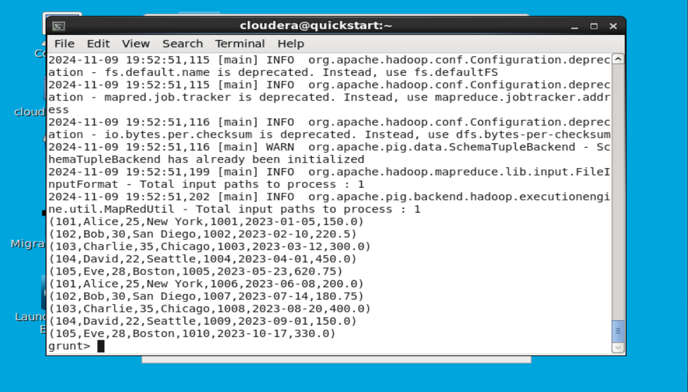

# Customer Orders Dataset Analysis

This repository provides a sample dataset of customer orders and includes queries for analyzing customer purchasing behaviors. Each query addresses a specific scenario, showcasing data filtering, grouping, joining, deduplication, sorting, and aggregation.

## Dataset Structure
The dataset consists of customer order records with the following columns:
| Column      | Data Type | Description                                         |
|-------------|-----------|-----------------------------------------------------|
| customer_id | int       | Unique ID for each customer                         |
| name        | chararray | Name of the customer                                |
| age         | int       | Age of the customer                                 |
| location    | chararray | Location of the customer                            |
| order_id    | int       | Unique order ID                                     |
| order_date  | chararray | Date the order was placed (YYYY-MM-DD)              |
| amount      | float     | Order amount in dollars                             |

### Sample Data

| customer_id | name | age | location | order_id | order_date | amount |
|---|---|---|---|---|---|---|
| 101 | Alice | 25 | New York | 1001 | 2023-01-05 | 150.00 |
| 102 | Bob | 30 | San Diego | 1002 | 2023-02-10 | 220.50 |
| ... | ... | ... | ... | ... | ... | ... |

## Analysis Scenarios and Queries

### 1. Filtering Customers by Age
 **Scenario:** Analyze customers who are adults (age 18 and above).
 
 **Query:** Load the dataset and filter out customers with age < 18.
 
 
 
 
   
